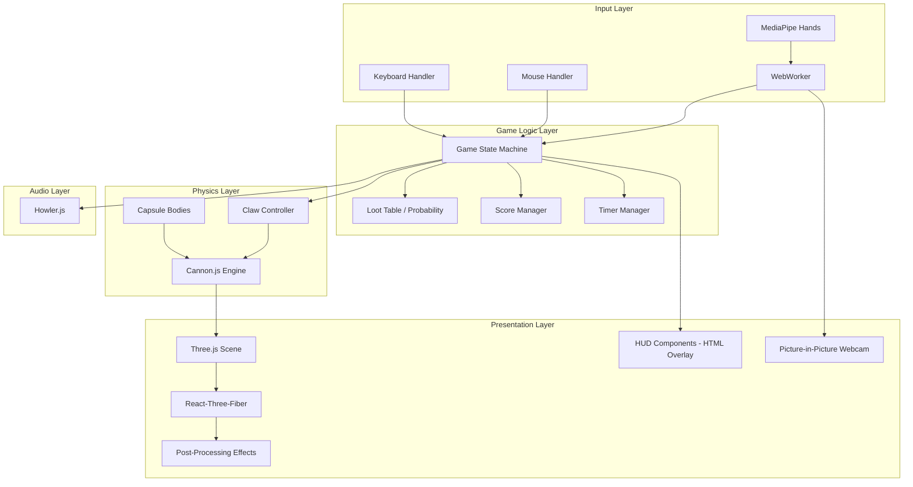
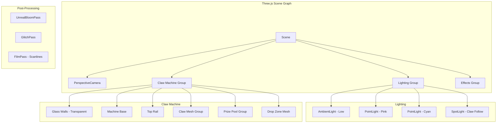

# Design Document: Neon Claw Game

## Overview

Neon Claw is a web-based 3D claw machine game built with React/Next.js and Three.js (via React-Three-Fiber), featuring a cyberpunk aesthetic and dual control modes (hand gesture via MediaPipe and mouse/keyboard). The game uses a "fake physics" approach where grab success is determined by probability tables rather than actual physics simulation, while Cannon.js provides visual polish for prize interactions in 3D space.

The architecture follows a layered approach:
- **Presentation Layer**: Three.js / React-Three-Fiber for 3D rendering with post-processing effects
- **Game Logic Layer**: State machine managing game flow
- **Physics Layer**: Cannon.js (cannon-es) for 3D physics simulation
- **Input Layer**: MediaPipe hand tracking + traditional input handlers
- **Audio Layer**: Howler.js for sound management

## Architecture



## 3D Scene Structure



## Components and Interfaces

### 1. Game State Machine

```typescript
interface GameState {
  phase: 'idle' | 'calibrating' | 'playing' | 'grabbing' | 'releasing' | 'results';
  controlMode: 'gesture' | 'default';
  score: number;
  timeRemaining: number;
  clawPosition: { x: number; y: number; z: number };
  clawState: 'hovering' | 'descending' | 'ascending' | 'holding';
  grabbedCapsule: Capsule | null;
  consecutiveFailures: number;
}

interface GameStateActions {
  startGame(): void;
  setControlMode(mode: 'gesture' | 'default'): void;
  moveClaw(targetX: number, targetZ: number): void;
  triggerGrab(): void;
  triggerRelease(): void;
  updateTimer(delta: number): void;
  endGame(): void;
}
```

### 2. Hand Tracker Interface

```typescript
interface HandTrackerConfig {
  maxNumHands: 1;
  modelComplexity: 1;
  minDetectionConfidence: 0.7;
  minTrackingConfidence: 0.5;
}

interface HandTrackingResult {
  detected: boolean;
  gesture: 'palm' | 'fist' | 'unknown';
  palmCenter: { x: number; y: number } | null;
  confidence: number;
}

interface HandTracker {
  initialize(videoElement: HTMLVideoElement): Promise<void>;
  onResult(callback: (result: HandTrackingResult) => void): void;
  start(): void;
  stop(): void;
}
```

### 3. Claw Controller Interface (3D)

```typescript
interface ClawConfig {
  maxSpeed: number;
  lerpFactor: number;
  deadzone: number;
  descentSpeed: number;
  ascentSpeed: number;
  clawOpenAngle: number;   // radians for finger spread
  clawCloseAngle: number;  // radians for finger close
}

interface ClawController {
  setTargetPosition(x: number, z: number): void;
  descend(): void;
  ascend(): void;
  openClaw(): void;
  closeClaw(): void;
  getPosition(): { x: number; y: number; z: number };
  getState(): 'hovering' | 'descending' | 'ascending' | 'holding';
  getMesh(): THREE.Group;
}
```

### 4. Loot Table Interface

```typescript
interface LootTableConfig {
  baseSuccessRate: number;  // e.g., 0.3 (30%)
  pityThreshold: number;    // e.g., 5 (guaranteed after 5 fails)
  pityBonus: number;        // e.g., 0.1 (10% bonus per fail)
}

interface LootTable {
  calculateSuccess(consecutiveFailures: number): boolean;
  getSuccessRate(consecutiveFailures: number): number;
}
```

### 5. Physics Manager Interface (Cannon.js)

```typescript
interface PhysicsConfig {
  gravity: { x: number; y: number; z: number };
  capsuleCount: number;
  capsuleRadius: number;
  machineBounds: {
    minX: number; maxX: number;
    minY: number; maxY: number;
    minZ: number; maxZ: number;
  };
}

interface PhysicsManager {
  initialize(config: PhysicsConfig): void;
  update(delta: number): void;
  getCapsules(): Capsule[];
  attachCapsuleToClaw(capsule: Capsule): void;
  detachCapsule(): void;
  getWorld(): CANNON.World;
}
```

### 6. Three.js Scene Manager Interface

```typescript
interface SceneConfig {
  backgroundColor: number;
  neonColors: { pink: number; cyan: number };
  bloomStrength: number;
  glitchIntensity: number;
}

interface SceneManager {
  initialize(canvas: HTMLCanvasElement): void;
  addMesh(mesh: THREE.Object3D): void;
  removeMesh(mesh: THREE.Object3D): void;
  updateLighting(clawPosition: THREE.Vector3): void;
  triggerScreenShake(intensity: number): void;
  triggerGlitchEffect(): void;
  render(): void;
}
```

### 7. Audio Manager Interface

```typescript
interface AudioManager {
  playBGM(): void;
  stopBGM(): void;
  playServoSound(): void;
  playGrabSound(): void;
  playSuccessSound(): void;
  playFailSound(): void;
}
```

## Data Models

### Capsule (3D)

```typescript
interface Capsule {
  id: string;
  body: CANNON.Body;
  mesh: THREE.Mesh;
  rarity: 'common' | 'rare' | 'epic';
  position: { x: number; y: number; z: number };
  isGrabbed: boolean;
  glowColor: number;  // hex color for neon glow
}
```

### Game Session

```typescript
interface GameSession {
  id: string;
  startTime: number;
  endTime: number | null;
  score: number;
  capsulesCaught: Capsule[];
  controlMode: 'gesture' | 'default';
}
```

### Serialized Game State

```typescript
interface SerializedGameState {
  version: string;
  timestamp: number;
  score: number;
  timeRemaining: number;
  capsules: Array<{
    id: string;
    x: number;
    y: number;
    z: number;
    rarity: string;
  }>;
  clawPosition: { x: number; y: number; z: number };
}
```


## Correctness Properties

*A property is a characteristic or behavior that should hold true across all valid executions of a system-essentially, a formal statement about what the system should do. Properties serve as the bridge between human-readable specifications and machine-verifiable correctness guarantees.*

### Property 1: Palm Coordinate to Claw Position Mapping

*For any* palm X/Y coordinate detected by the Hand_Tracker (normalized 0-1), the Claw target position SHALL be mapped to corresponding X/Z positions within the 3D play area bounds using a linear transformation.

**Validates: Requirements 2.4**

### Property 2: Fist Gesture Debounce

*For any* sequence of gesture detection frames, the grab action SHALL trigger if and only if at least 5 consecutive frames detect a fist gesture.

**Validates: Requirements 2.5**

### Property 3: Fist-to-Palm Release Trigger

*For any* gesture state transition from fist to palm, the release action SHALL be triggered exactly once.

**Validates: Requirements 2.6**

### Property 4: Claw Movement with Lerp Smoothing

*For any* target position and current claw position, the new claw position SHALL be calculated as: `newPos = currentPos + (targetPos - currentPos) * lerpFactor` where lerpFactor is between 0 and 1.

**Validates: Requirements 3.1**

### Property 5: Deadzone Filter for Mouse Input

*For any* mouse movement delta, if the absolute delta is less than the deadzone threshold, the claw target position SHALL remain unchanged.

**Validates: Requirements 3.2**

### Property 6: Velocity Speed Clamping

*For any* calculated claw velocity, the actual applied velocity SHALL be clamped to not exceed MAX_SPEED in magnitude.

**Validates: Requirements 3.3**

### Property 7: Claw Boundary Constraint (Invariant)

*For any* claw position at any point in time, the coordinates SHALL be within the 3D bounds defined by machineBounds (minX/maxX, minY/maxY, minZ/maxZ).

**Validates: Requirements 3.4**

### Property 8: Pity System Guarantee

*For any* number of consecutive grab failures >= 5, the Loot_Table SHALL return success (100% probability) on the next grab attempt.

**Validates: Requirements 4.5**

### Property 9: Score Increment on Drop Zone Entry

*For any* capsule that enters the Drop_Zone, the score SHALL increase by exactly 1, and the total score SHALL equal the count of capsules that have entered the Drop_Zone.

**Validates: Requirements 5.2**

### Property 10: Timer Format Display

*For any* time value in seconds (0-30), the HUD display SHALL format it as MM:SS where MM is zero-padded minutes and SS is zero-padded seconds.

**Validates: Requirements 6.2**

### Property 11: Contextual Prompts for Game States

*For any* game state (idle, calibrating, playing, grabbing, releasing, results), there SHALL exist a corresponding non-empty prompt message.

**Validates: Requirements 8.4**

### Property 12: Game State Serialization Round-Trip

*For any* valid GameState object, serializing to JSON and then deserializing SHALL produce a GameState object equivalent to the original.

**Validates: Requirements 10.1, 10.2, 10.3**

## Error Handling

### Input Errors

| Error Condition | Handling Strategy |
|----------------|-------------------|
| Webcam permission denied | Fall back to default mode, display notification |
| Hand tracking lost | Display "Lost" indicator, pause claw movement, resume on re-detection |
| Invalid gesture detected | Ignore frame, continue with previous state |
| MediaPipe initialization failure | Fall back to default mode with error message |

### Physics Errors

| Error Condition | Handling Strategy |
|----------------|-------------------|
| Physics body penetration | Reset body position to last valid state |
| Constraint creation failure | Log error, treat as grab failure |
| Frame rate drop below 30fps | Reduce particle effects, disable non-essential post-processing |

### 3D Rendering Errors

| Error Condition | Handling Strategy |
|----------------|-------------------|
| WebGL context lost | Attempt to restore context, show fallback UI if failed |
| Texture loading failure | Use fallback solid color materials |
| Post-processing failure | Disable effects, continue with basic rendering |

### State Errors

| Error Condition | Handling Strategy |
|----------------|-------------------|
| Invalid state transition | Log warning, remain in current state |
| Timer overflow/underflow | Clamp to valid range [0, 30] |
| Score corruption | Reset to last known valid score |
| Serialization failure | Return error, do not save |
| Deserialization failure | Return error, start fresh game |


## Technology Stack Summary

| Layer | Technology | Purpose |
|-------|------------|---------|
| 3D Rendering | Three.js + React-Three-Fiber | 3D scene, meshes, materials |
| Post-Processing | @react-three/postprocessing | Bloom, glitch, film grain effects |
| Physics | cannon-es + @react-three/cannon | 3D rigid body physics |
| Hand Tracking | MediaPipe Hands | Gesture recognition |
| State Management | Zustand or XState | Game state machine |
| Audio | Howler.js | Sound effects and BGM |
